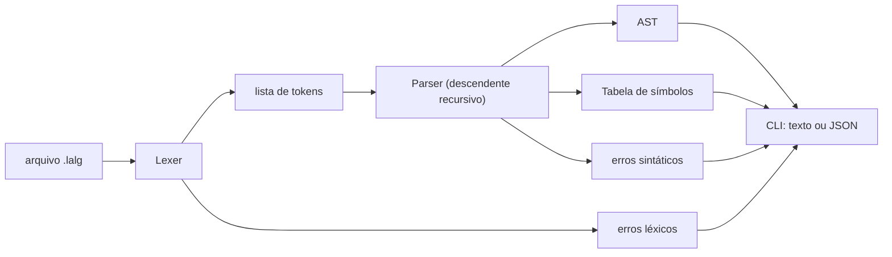

# Relatório — Trabalho 2: Analisador Sintático (LALG)

> Disciplina: **SCC0217 — Linguagens de Programação e Compiladores**
> Professor: **Dr. Diego Raphael Amancio**
> Linguagem analisada: **LALG** (Pascal-like)

## 1. Membros do grupo

> ⚠️ **Preencher antes da entrega.**
>
> - `Nome 1` — NUSP `xxxxxxxx`
> - `Nome 2` — NUSP `xxxxxxxx`
> - `Nome 3` — NUSP `xxxxxxxx`

## 2. Visão geral

Este trabalho implementa o **analisador sintático** da linguagem LALG **manualmente em
Python 3**, conforme permitido pelo enunciado ("A implementação também pode ser feita
manualmente"). Reaproveitamos o analisador léxico do Trabalho 1 como módulo auxiliar — ele
fornece o fluxo de tokens consumido pelo sintático, atendendo ao item 2 do enunciado:

> *substitua o programa principal do Trabalho 1 pelo analisador sintático. Verifique que o
> analisador léxico esteja funcionando corretamente.*

O analisador é um **descendente recursivo (LL)**, com uma função/método para cada
não-terminal da gramática. Ele produz:

- **AST** (árvore sintática abstrata) serializável em JSON;
- **tabela de símbolos** com escopos para procedimentos;
- **lista de diagnósticos** com linha, coluna e mensagem específica.

O código vive em [`analisador-sintatico/src/lalg_sintatico/`](../analisador-sintatico/src/lalg_sintatico).
Há também uma cópia funcional do mesmo módulo dentro do pacote do Trabalho 1
([`analisador-lexico/src/lalg/parser.py`](../analisador-lexico/src/lalg/parser.py)) —
ambas as versões são equivalentes.

## 3. Decisões de projeto e justificativas

### 3.1. Implementação manual em Python (sem YACC/JavaCC)

- gramática LL(1) simples cabe naturalmente em parser descendente recursivo manual;
- mantém o projeto no mesmo ecossistema do Trabalho 1, sem dependências externas;
- facilita a recuperação em modo pânico, pois o código pode tomar decisões finas em cada
  ponto da gramática.

### 3.2. Tokens nomeados, sem códigos numéricos

Os tokens vêm do mesmo módulo do Trabalho 1, com nomes simbólicos
(`PROGRAM`, `SEMICOLON`, `IDENTIFIER`, …). Isso mantém a coerência dos dois trabalhos.

### 3.3. Recuperação de erros — modo pânico

Conforme o item 3 do enunciado:

> *Implementar o tratamento de erro usando o modo pânico, sempre relatando os erros para o
> usuário.*

Implementação:

- **Sempre relatamos** o erro (linha, coluna, mensagem específica) — o analisador **não
  para** na primeira falha, permitindo listar vários erros numa única execução.
- O analisador mantém dois conjuntos de "tokens-âncora" (sincronização):
  - `STATEMENT_START = {BEGIN, IF, WHILE, READ, WRITE, IDENTIFIER}`
  - `DECLARATION_START = {VAR, PROCEDURE, BEGIN}`
- Métodos `_synchronize_statement()` e `_synchronize_declaration()` consomem tokens até
  encontrar uma âncora (ou `;`/`end`/`else`), retomando a partir dali. Esse é o **modo
  pânico clássico** descrito em Aho/Sethi/Ullman.
- Mensagens de erro são **específicas**: `Esperado ';' após o cabeçalho do programa.`,
  `Esperado ':' antes do tipo da declaração.`, `Identificador 'x' não declarado.`, etc.

### 3.4. Tabela de símbolos com escopo de procedimento

Implementada em [symbols.py](../analisador-sintatico/src/lalg_sintatico/symbols.py).
Cada nome é registrado com **categoria** (`programa`, `variável`, `parâmetro`,
`procedimento`) e **tipo** (`inteiro`, `real`, `booleano`, ou `None`). Para procedimentos,
o nome interno é qualificado pelo escopo: `calcula.a`, `calcula.soma`, etc. Isso evita
colisões e habilita relatórios como:

```text
Tabela de símbolos:
- exemplo (programa, tipo=None)
- total (variável, tipo=inteiro)
- calcula (procedimento, tipo=None)
- calcula.a (parâmetro, tipo=inteiro)
- calcula.soma (variável, tipo=inteiro)
```

### 3.5. AST simples e serializável

Cada nó é um `ASTNode(kind, value, children)` com método `as_dict()` recursivo.
Isso facilita inspeção via `--json` e habilita integração futura com análise semântica e
geração de código.

### 3.6. Comentários e cadeias permanecem responsabilidade do léxico

Comentários `{}`, `(* *)` e `//` são consumidos pelo léxico e nunca chegam ao sintático,
atendendo ao item de avaliação "tratamento de comentários".

### 3.7. Interface (CLI) intuitiva

O enunciado ressalta:

> *A usabilidade da interface gráfica ou linha de comando será avaliada, considerando que a
> interface seja intuitiva, simples e amigável.*

A CLI usa `argparse`, com `--help`, e tem três modos: amigável, `--tokens`, `--json`.
Mensagens de ajuda em português. Saída amigável imprime erros agrupados por seção e a
tabela de símbolos formatada.

## 4. Gramática suportada

A gramática completa, em estilo BNF/EBNF, está em
[especificacao-sintatica.md](especificacao-sintatica.md). Resumo:

```text
programa         -> PROGRAM IDENTIFICADOR ';' bloco '.'
bloco            -> declaracoes procedimento* comando_composto
declaracoes      -> VAR (ids ':' tipo ';')*
ids              -> IDENTIFICADOR (',' IDENTIFICADOR)*
tipo             -> INTEGER | REAL | BOOLEAN
procedimento     -> PROCEDURE IDENTIFICADOR parametros? ';' bloco ';'
parametros       -> '(' lista_parametros? ')'
lista_parametros -> ids ':' tipo (';' ids ':' tipo)*
comando_composto -> BEGIN comando (';' comando)* END
comando          -> atribuicao | chamada | comando_composto
                  | se | enquanto | leia | escreva
atribuicao       -> IDENTIFICADOR ':=' expressao
chamada          -> IDENTIFICADOR ('(' argumentos? ')')?
se               -> IF expressao THEN comando (ELSE comando)?
enquanto         -> WHILE expressao DO comando
leia             -> READ '(' ids ')'
escreva          -> WRITE '(' argumentos? ')'
argumentos       -> expressao (',' expressao)*
expressao        -> expressao_simples (op_rel expressao_simples)*
expressao_simples-> ('+'|'-')? termo (op_ad termo)*
termo            -> fator (op_mul fator)*
fator            -> IDENTIFICADOR | NUMERO_INTEIRO | NUMERO_REAL
                  | CADEIA | TRUE | FALSE
                  | NOT fator | '(' expressao ')'
op_rel           -> '=' | '<>' | '<' | '<=' | '>' | '>='
op_ad            -> '+' | '-' | OR
op_mul           -> '*' | '/' | DIV | MOD | AND
```

## 5. Visão geral dos módulos

```text
analisador-sintatico/src/lalg_sintatico/
  tokens.py    # tokens reaproveitados do Trabalho 1
  lexer.py     # léxico auxiliar (idêntico em comportamento ao do T1)
  parser.py    # analisador descendente recursivo + recuperação em modo pânico
  ast.py       # nós da AST (ASTNode + as_dict())
  symbols.py   # tabela de símbolos com escopos
  errors.py    # diagnósticos (linha, coluna, mensagem)
  cli.py       # programa principal (argparse) — saída amigável e --json
```

Diagrama do fluxo:



## 6. Passo a passo: como compilar/interpretar e executar

```bash
# 1) Garanta Python >= 3.10
python3 --version

# 2) Entre na pasta do analisador sintático
cd analisador-sintatico

# 3) Execute sobre um arquivo-fonte
PYTHONPATH=src python3 -m lalg_sintatico.cli examples/valido.lalg

# 4) Variantes
PYTHONPATH=src python3 -m lalg_sintatico.cli examples/valido.lalg --tokens
PYTHONPATH=src python3 -m lalg_sintatico.cli examples/valido.lalg --json
PYTHONPATH=src python3 -m lalg_sintatico.cli examples/invalido.lalg
```

Códigos de saída do CLI:

- `0` — nenhum erro léxico ou sintático;
- `1` — pelo menos um erro detectado;
- `2` — falha ao abrir o arquivo.

## 7. Exemplos de execução

### 7.1. Programa válido — [`exemplos-fonte/sintatico-valido.lalg`](exemplos-fonte/sintatico-valido.lalg)

```pascal
programa exemplo;
var
  total: inteiro;
  media: real;
  aprovado: booleano;

procedimento calcula(a, b: inteiro; mostrar: booleano);
var
  soma: inteiro;
inicio
  soma := a + b;
  media := soma / 2.0;
  aprovado := media >= 6.0;
  se mostrar entao
    escreva("media", media)
  senao
    escreva("oculto")
fim;

inicio
  leia(total);
  calcula(total, 8, verdadeiro);
  enquanto aprovado faca
  inicio
    escreva("aprovado");
    aprovado := falso
  fim
fim.
```

Saída amigável (cópia em [`saidas/sintatico-valido.txt`](saidas/sintatico-valido.txt)):

```text
Análise sintática concluída com sucesso.

Tabela de símbolos:
- exemplo (programa, tipo=None)
- total (variável, tipo=inteiro)
- media (variável, tipo=real)
- aprovado (variável, tipo=booleano)
- calcula (procedimento, tipo=None)
- calcula.a (parâmetro, tipo=inteiro)
- calcula.b (parâmetro, tipo=inteiro)
- calcula.mostrar (parâmetro, tipo=booleano)
- calcula.soma (variável, tipo=inteiro)
```

A AST completa (com declarações, procedimentos, comandos compostos, comandos `enquanto`,
`se/senao`, `leia`, `escreva` e expressões) está em
[`saidas/sintatico-valido.json`](saidas/sintatico-valido.json).

### 7.2. Programa inválido — [`exemplos-fonte/sintatico-invalido.lalg`](exemplos-fonte/sintatico-invalido.lalg)

```pascal
programa exemplo
var
  x inteiro;
inicio
  y := 10
  escreva(@)
fim
```

Saída (cópia em [`saidas/sintatico-invalido.txt`](saidas/sintatico-invalido.txt)):

```text
Erros léxicos:
- Caractere inesperado '@'. (linha 6, coluna 11)

Erros sintáticos/semânticos simples:
- Esperado ';' após o cabeçalho do programa. (linha 2, coluna 1)
- Esperado ':' antes do tipo da declaração. (linha 3, coluna 5)
- Identificador 'y' não declarado. (linha 5, coluna 3)
- Esperado ';' entre comandos. (linha 6, coluna 3)
- Esperado '.' ao final do programa. (linha 8, coluna 1)

Tabela de símbolos:
- exemplo (programa, tipo=None)
- x (variável, tipo=inteiro)
```

Esse exemplo demonstra o **modo pânico** em ação: cinco erros distintos foram reportados
numa única execução, e o analisador conseguiu continuar lendo o arquivo até o fim em vez
de abortar no primeiro problema.

## 8. Testes automatizados

```bash
cd analisador-sintatico
PYTHONPATH=src python3 -m unittest discover -s tests -v
```

Resultado (cópia em [`saidas/testes-sintatico.txt`](saidas/testes-sintatico.txt)):

```text
test_reports_lexical_errors (test_lexer.LexerTest) ... ok
test_unicode_bom_keywords_and_not_equal (test_lexer.LexerTest) ... ok
test_reports_missing_declaration (test_parser.ParserTest) ... ok
test_reports_syntax_error (test_parser.ParserTest) ... ok
test_valid_complete_program (test_parser.ParserTest) ... ok

----------------------------------------------------------------------
Ran 5 tests in 0.003s

OK
```

## 9. Boas práticas adotadas

O enunciado enumera:

> *• Documentação do código*
> *• Variáveis e sub-rotinas com nomes significativos*
> *• Indentação*

Aplicações no projeto:

- **Documentação**: docstrings nas classes principais (`Lexer`, `Parser`) e tipos
  (`Token`, `Diagnostic`, `Symbol`).
- **Nomes significativos**: métodos refletem não-terminais (`_program`, `_block`,
  `_variable_declarations`, `_procedure_declaration`, `_compound_statement`, `_statement`,
  `_if_statement`, `_while_statement`, `_read_statement`, `_write_statement`, `_expression`,
  `_simple_expression`, `_term`, `_factor`).
- **Indentação consistente** de 4 espaços, conforme PEP 8.

## 10. Itens da rubrica do PDF — onde cada um foi atendido

| Item da rubrica | Onde foi atendido |
|-----------------|-------------------|
| **10% — Relatório / especificação YACC/JavaCC** | Este arquivo + [especificacao-sintatica.md](especificacao-sintatica.md). |
| **80% — Análise sintática com tratamento de erros** | [parser.py](../analisador-sintatico/src/lalg_sintatico/parser.py) (modo pânico, mensagens específicas) + casos de teste em [tests/test_parser.py](../analisador-sintatico/tests/test_parser.py) + saídas em [saidas/](saidas/). |
| **10% — Programa principal varrendo o arquivo, comentários, etc.** | [cli.py](../analisador-sintatico/src/lalg_sintatico/cli.py) (programa principal); comentários tratados pelo léxico em [lexer.py](../analisador-sintatico/src/lalg_sintatico/lexer.py). |
